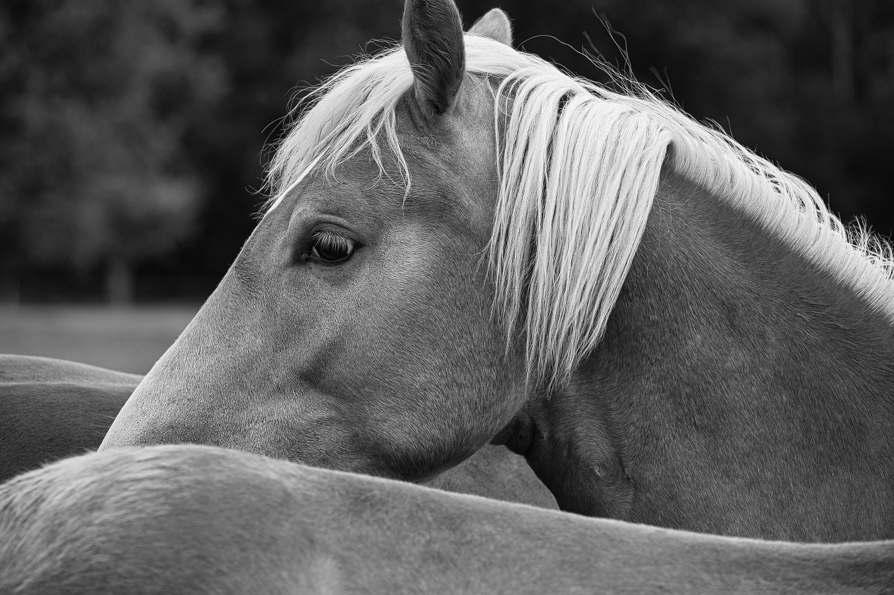

# Image_processing_CUDA
This is for those who starts writing with CUDA and OpenCV.

Source code is written very simple and easy to process image with CUDA.
<table>
  <tr>
    <td></td>
    <td></td>
  </tr>
  <tr>
    <td align="middle">Input Image</td>
    <td align="middle">Output Image After Median Blur</td>
  </tr>
</table>

# Build and Execution

## Dependencies

  * CMake 2.8.11 or higher.
  * Cuda 7.5 or higher.
  * GCC 4.8.
  * OpenCV 3.1 or higher.

## Build (Linux)

    git clone https://github.com/nagaitomoaki/Image_processing_CUDA.git
    mkdir build
    cd build
    cmake ..
    make
    ./main
